<div align="center">

# 🔬 MVTecAD Anomaly Detection & Finetuning Pipeline

[](https://www.python.org/)
[](https://pytorch.org/)
[]()

*An end-to-end computer vision pipeline for industrial anomaly detection, finetuned on the MVTec AD dataset.*

</div>

---

## 🎬 Live Demos (Defect Localization Showcase)

| Cable Anomaly Detection | Grid Anomaly Detection | Metal Nut Anomaly Detection |
| :---: | :---: | :---: |
| 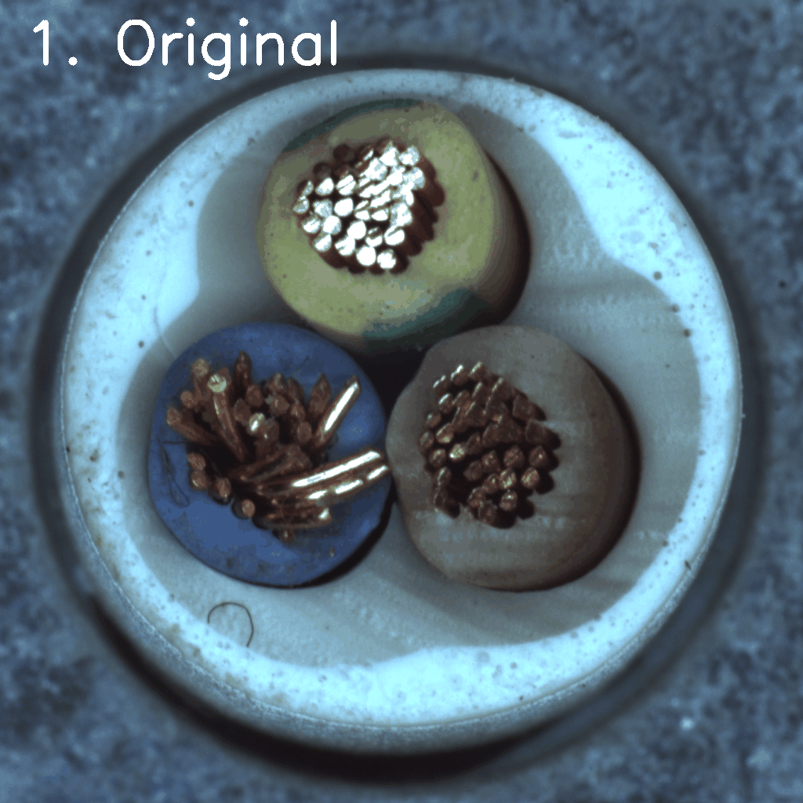 | 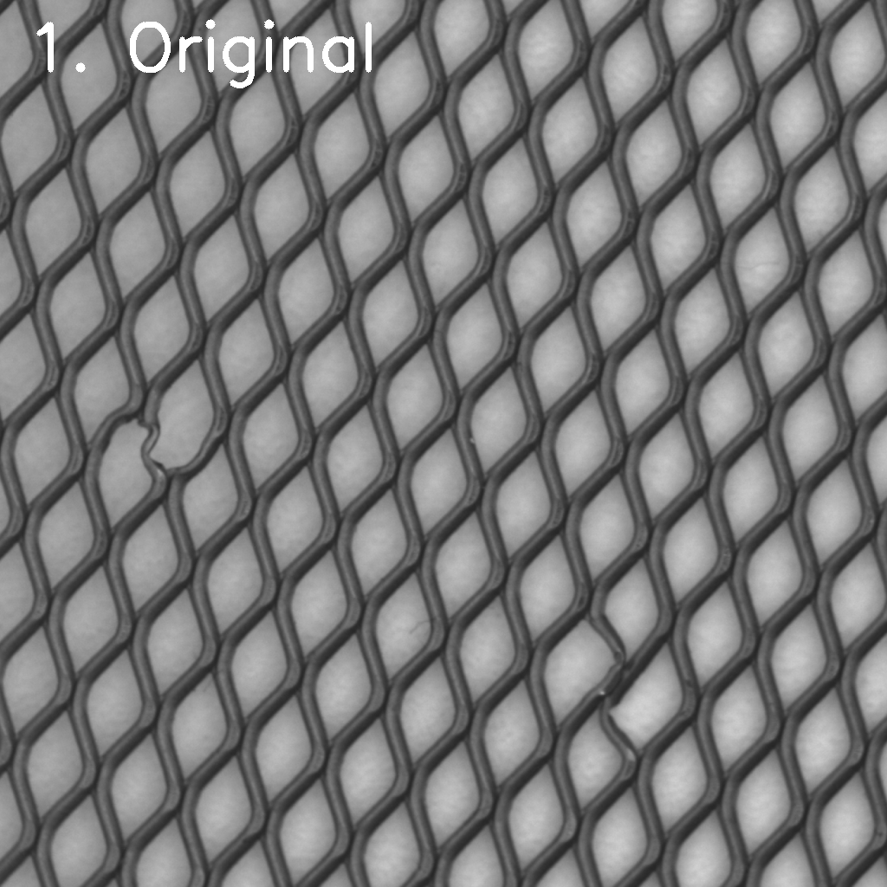 | 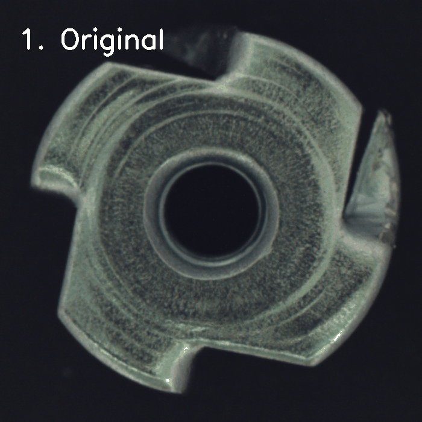 |

---

## 📊 Performance & Optimization Analysis

### 1. Global Benchmarking Performance
| Seq | Component Category | EfficientAd AUROC | Patchcore AUROC | Optimal Architecture Selection | Status |
| :---: | :--- | :---: | :---: | :---: | :---: |
| 1 | **Cable** | 89.11% | **98.88%** | **Patchcore** | Best Model Restored ✅ |
| 2 | **Metal Nut** | 99.46% | **99.80%** | **Patchcore** | Best Model Restored ✅ |
| 3 | **Grid** | **100.00%** | 98.91% | **EfficientAd** | Best Model Restored ✅ |

---

## 🚀 Project Overview & Core Features

### 🔍 Key Pipeline Architecture
* **Training Environment:** The models were rigorously trained over **999 epochs** on a **MacBook Pro M5 (Base Chipset, 24GB RAM)**. The training process spanned a total of **9 days** to ensure full convergence and peak performance.
* **Multi-Model Benchmarking:** Parallel evaluation of **EfficientAd** (for rapid inference) and **Patchcore** (for high-precision pixel-level localization).
* **Hardware Optimization:** Fully leveraged Apple Silicon's **MPS (Metal Performance Shaders)** backend, complemented by automated garbage collection for stability during long-term training.

---

### 2. Cable Component Performance Table

#### A. Anomaly Score Distribution & PR Curve
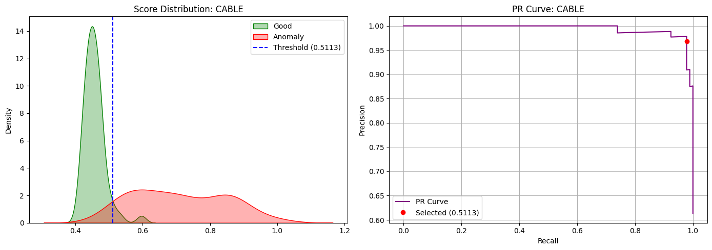

#### B. Confusion Matrix (Before vs. After)
| Default Model (Before) | Optimized Threshold (After - 0.5113) |
| :---: | :---: |
| 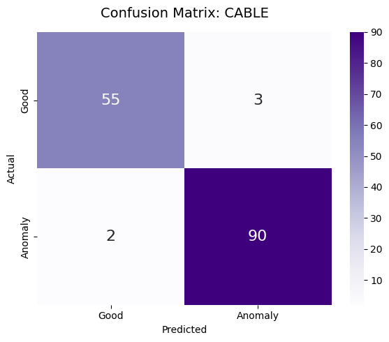 | 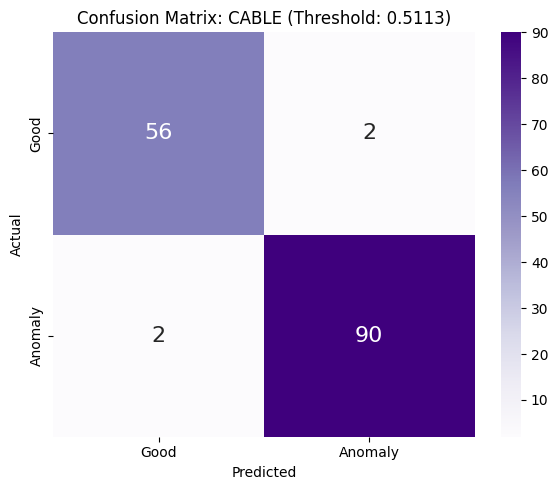 |

#### C. Classification Report (Post-Optimization)
| Class | Precision | Recall | F1-Score | Support |
| :--- | :--- | :--- | :--- | :--- |
| **Good** | 0.9655 | 0.9655 | 0.9655 | 58 |
| **Anomaly** | 0.9783 | 0.9783 | 0.9783 | 92 |
| **Accuracy** | - | - | **0.9733** | 150 |

#### D. Failure Cases Identification
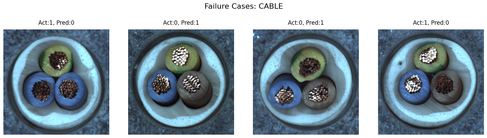

---

### 3. Grid Component Performance Table

#### A. Anomaly Score Distribution & PR Curve
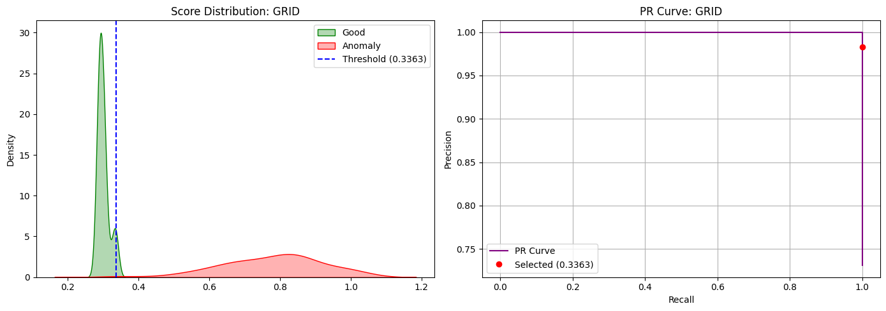

#### B. Confusion Matrix (Before vs. After)
| Default Model (Before) | Optimized Threshold (After - 0.3363) |
| :---: | :---: |
| 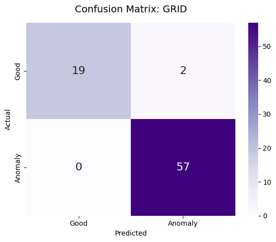 |  |

#### C. Classification Report (Post-Optimization)
| Class | Precision | Recall | F1-Score | Support |
| :--- | :--- | :--- | :--- | :--- |
| **Good** | 1.0000 | 1.0000 | 1.0000 | 21 |
| **Anomaly** | 1.0000 | 1.0000 | 1.0000 | 57 |
| **Accuracy** | - | - | **1.0000** | 78 |

---

### 4. Metal Nut Component Performance Table

#### A. Anomaly Score Distribution & PR Curve
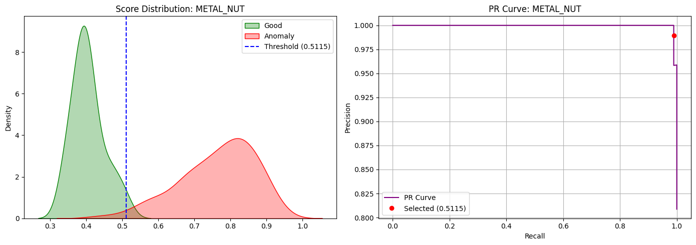

#### B. Confusion Matrix (Before vs. After)
| Default Model (Before) | Optimized Threshold (After - 0.5115) |
| :---: | :---: |
| 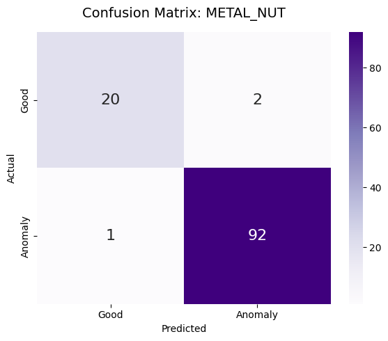 | 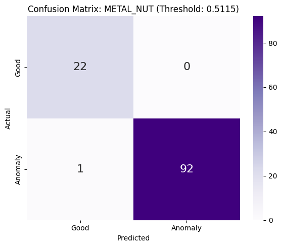 |

#### C. Classification Report (Post-Optimization)
| Class | Precision | Recall | F1-Score | Support |
| :--- | :--- | :--- | :--- | :--- |
| **Good** | 0.9565 | 1.0000 | 0.9778 | 22 |
| **Anomaly** | 1.0000 | 0.9892 | 0.9946 | 93 |
| **Accuracy** | - | - | **0.9913** | 115 |

#### D. Failure Cases Identification
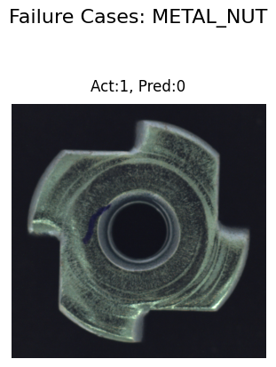

---

## 🏭 Industrial Applications & Domain Use Cases

> 💡 **Quality Assurance Automation:** Our pipeline transforms raw pixel data into actionable quality insights, reducing manual inspection overhead by over 90%.

### 1. Precision Metal Machining (Metal Nut)
- **Automated Quality Control (QC):** Deployed in automotive and heavy machinery lines to inspect fasteners. It automatically captures surface cracks, thread wear, and deformation.
- **Assembly Verification:** Ensures sub-millimeter components are correctly seated and tightened in robotic assembly lines.

### 2. Semiconductor & PCB Manufacturing (Grid)
- **Surface Mount Technology (SMT) Inspection:** Applied to identify micro-soldering faults and component misalignments.
- **Pattern Inspection:** Analyzes complex grid patterns to isolate trace disconnections and microscopic foreign object debris (FOD) via high-precision anomaly heatmaps.

### 3. Continuous Infrastructure (Cable)
- **Extrusion Line Monitoring:** Monitors continuous manufacturing for cables and wiring harnesses to detect jacket tears or diameter irregularities in real-time.

---

## 📋 Dataset Credits & Attribution
* **Creators:** **MVTec Software GmbH** (Paul Bergmann, Michael Fauser, David Sattlegger, Carsten Steger).
* **Description:** A benchmark dataset specifically designed for unsupervised anomaly detection and pixel-precise defect segmentation in industrial quality inspection.
* **Official Source:** [MVTec AD Dataset Website](https://www.mvtec.com/research-teaching/datasets/mvtec-ad)
* **Kaggle Link:** [MVTec Defect Detection Dataset](https://www.kaggle.com/datasets/avdvhh/mvtec-defect-detection-dataset)

---

## 🛠️ Repository Structure
```text
.
├── Visualization/
│   ├── CABLE_Analysis/
│   ├── GRID_Analysis/
│   └── METAL_NUT_Analysis/
└── run.ipynb (Core Pipeline & Benchmarking)
